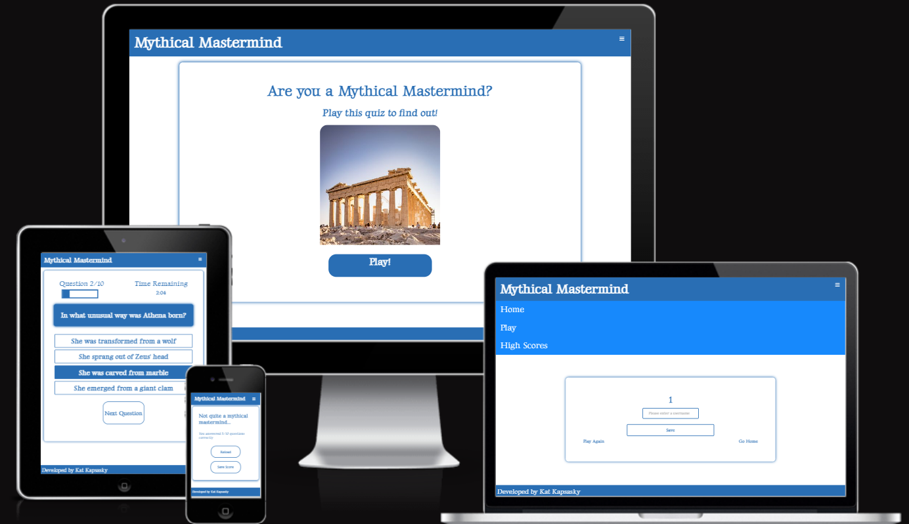
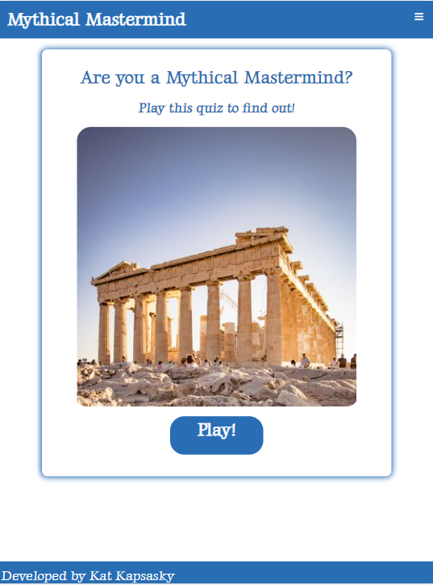
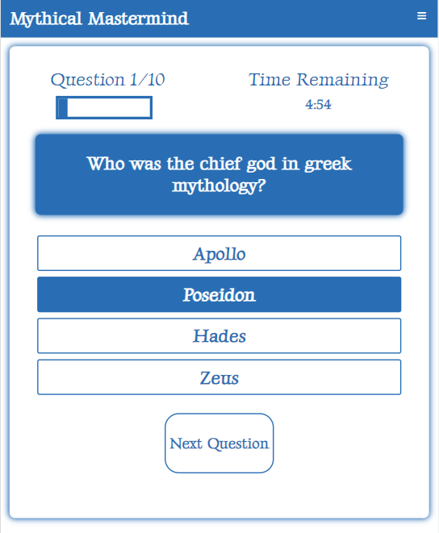
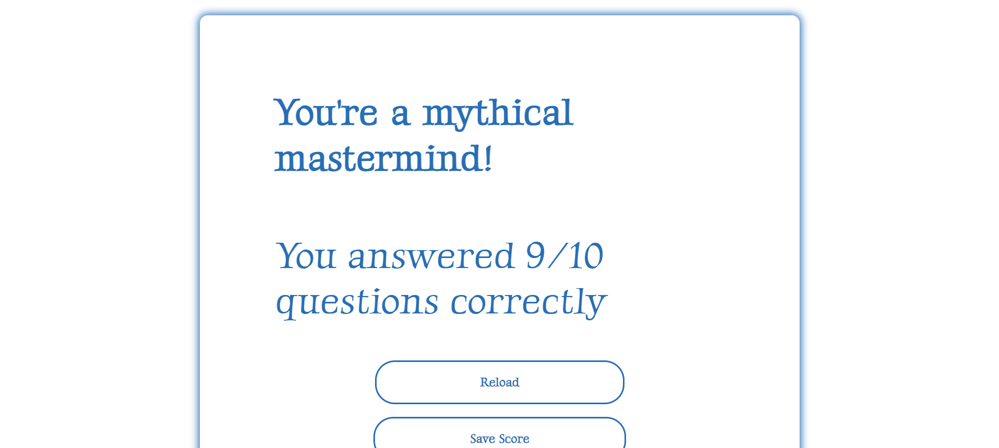
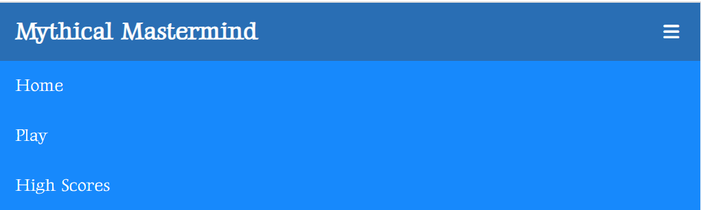
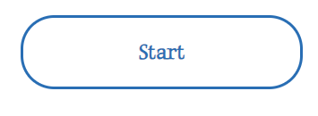

# Mythical Mastermind

Mythical Mastermind is a history knowledge quiz which tests the user on greek mythology facts. 

Users of the website will be able to play the quiz to test their knowledge of greek mythology, receive feedback on how many questions they got right and retry the quiz, for practice and to try get a higher score.

---

## UX

The website is made up of two pages, the initial landing page and the play page where users can play the quiz. Both pages have a consistent header, logo and footer, as well as the same font and color scheme. 

### User Stories

As a user, 
- I would like to test my greek mythology knowledge
- I would like to see how many questions there are in the quiz and my progress
- I would like to receive a score at the end showing how many answers were correct
- I would like to play the quiz multiple times for practice

### Color Scheme

The colors are inspired by Greece and greek mythology and was generated using [Coolors](https://coolors.co).

### Typography

The fonts were imported from [Google Fonts](https://fonts.google.com/). Gideon Roman is used for the logo and all headings, and Luxurious Roman is used for all other body elements.

The hamburger icon for the dropdown menu was taken from [Font Awesome.](https://fontawesome.com/icons)

### Wireframes

| Page | Responsiveness | Wireframe |
| --- | --- | --- |
| Home Page |  |  |
| Home Page |  |  |
| Home Page |  |  |
| Play Page |  |  |
| Play Page |  |  |
| Play Page |  |  |
| Results Page |  | 
| Results Page |  | 
| Results Page |  | 

---

## Features

Mythical Mastermind consists of two main pages, the homepage with a welcome section and the play page where users can interact with the quiz.

### Existing Features

#### Header
The header contains the navbar which is made up of the Mythical Mastermind logo on the left, and the dropdown hamburger menu on the right which when clicked displays clickable links to the homepage and play page to allow the user to easily navigate between the site pages. The logo is also a clickable link for the homepage. The header is consistent across all pages of the site.

#### Footer
The footer is fixed to the bottom of the page and consist across the site. It contains my name as developer of the project.

#### Welcome Section
The welcome section explains the site's purpose and includes an image of the Acropolis in Athens and a link to play the quiz.

#### Start Button
The start button initiates the quiz for the user.

#### Quiz 
The quiz is made up of a 10 questions, shown one after the other once a user has selected an answer and clicked the next question button. Each question offers the user four answer options to choose from before moving on to the next question. The user is required to choose an answer before moving on, and once an answer is selected that option will turn blue with white font as a signal to the user that their answer has been checked.

#### Quiz Result
The quiz result text will depend on if the user has scored more than 7/10 points, determining if they are a mythical mastermind or not. The result will also show the number of correct answers out of the total questions in the quiz and offer the user the option to reload and try the quiz again. 

### Future Features 

- Enable users to create a username and store their score using local storage
- A high scores page so users can track their previous scores
- Different result text for each of the scores of the text along with relevant images
- Show users which questions they got wrong so they can improve those specifically
- Add more than 10 questions and randomize the questions shown

---

## Technologies Used

- HTML: Used for site layout and context
- CSS: Used for site layout and aesthetics
- Javascript: Used for interactivity
- [Gitpod](https://gitpod.io): Used as a cloud-based development IDE
- [Github](https://github.com/): Used to securely store my code online
- [Git](https://git-scm.com/): Used for version control
- [Balsamiq](https://balsamiq.com/): Used for making wireframes
- [Image Resizer](https://imageresizer.com/): Used for resizing images
- [Coolors](https://coolors.co/b1740f-ffd07b-fdb833-296eb4-1789fc): Used for creating the website color palette

---

## Testing

For all testing please refer to the [TESTING.md](TESTING.md) file.

---

## Deployment

The site was deployed to GitHub pages. The steps to deploy are as follows: 
  - In the [GitHub repository](https://github.com/katkapsasky/mythical-mastermind), navigate to the Settings tab 
  - From the source section drop-down menu, select the **Main** Branch, then click "Save".
  - The page will be automatically refreshed with a detailed ribbon display to indicate the successful deployment.

The live link can be found [here](https://katkapsasky.github.io/mythical-mastermind/)

### Local Deployment

In order to make a local copy of this project, you can clone it. In your IDE Terminal, type the following command to clone my repository:

- `git clone https://github.com/katkapsasky/mythical-mastermind.git`

Alternatively, if using Gitpod, you can click below to create your own workspace using this repository.

## Credits

### Code

[W3 Schools: How to Create a Mobile Navigation Menu](https://www.w3schools.com/howto/howto_js_mobile_navbar.asp) for the hamburger menu

[Coding with Nick: Create a Quiz App](https://codingwithnick.in/create-a-quiz-app-using-html-css-javascript/) for css box styling and the interactive quiz elements:
 - looping through questions
 - checking for the correct answer
 - keeping score
 - showing the result at the end

[Brian Design: How to Make a Quiz App using HTML CSS Javascript - Vanilla Javascript Project for Beginners Tutorial](https://www.youtube.com/watch?v=f4fB9Xg2JEY) for the question progress counter

[FreeCodeCamp: How to Keep your Footer Where it Belongs](https://www.freecodecamp.org/news/how-to-keep-your-footer-where-it-belongs-59c6aa05c59c/) to fix the footer sticking to the quiz question box

[Kat Kapsasky: Yorkshire Art House](https://github.com/katkapsasky/yorkshire-art-house) for the ReadMe and Testing templates

### Content

[Britannica.com: Gods, Goddesses and Greek Mythology](https://www.britannica.com/quiz/gods-goddesses-and-greek-mythology) for the quiz questions

### Media

[Florian Wehde, Unsplash](https://unsplash.com/photos/z7YyCp7s-LU) for the welcome section image

---