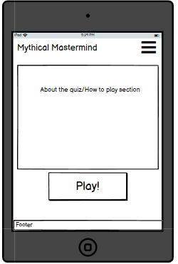
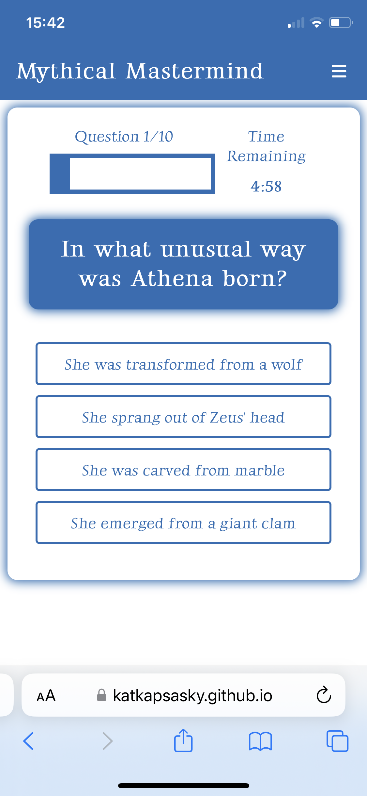
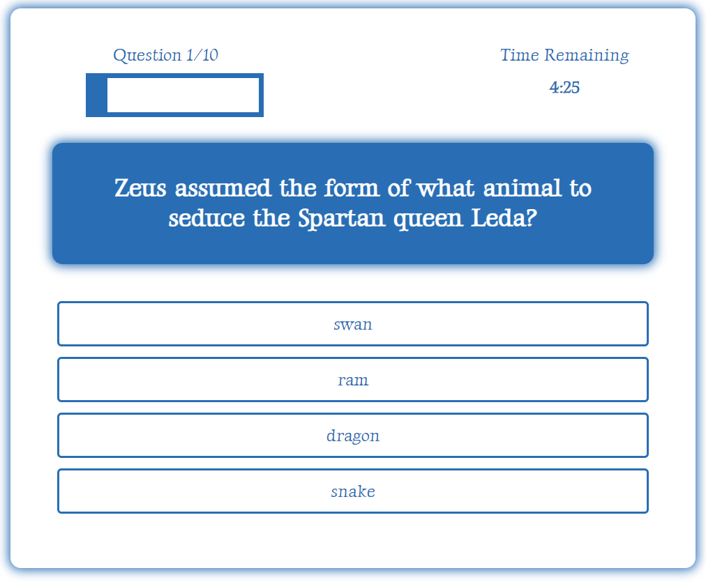
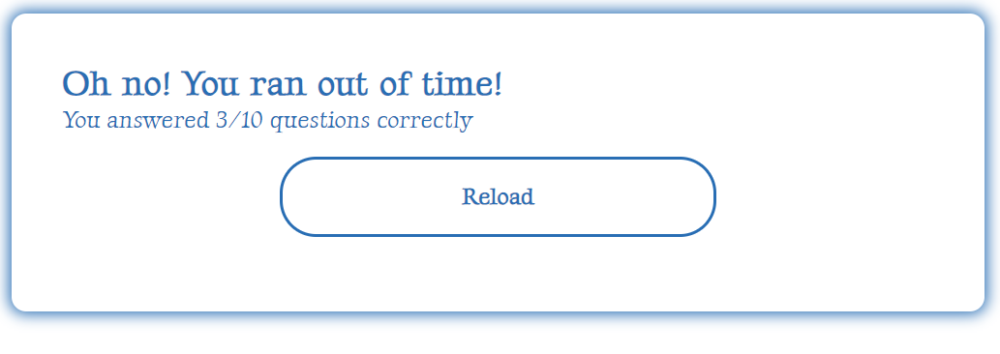

# Mythical Mastermind

Mythical Mastermind is a history knowledge quiz which tests the user on greek mythology facts. 

Users of the website will be able to play the quiz to test their knowledge of greek mythology, receive feedback on how many questions they got right and retry the quiz, for practice and to try get a higher score. Users can also save their username and score after playing and view high scores on the High Scores page.

---

## UX

The website is made up of four pages. The initial landing (home) page, the play page where users can play the quiz, the end page where users can see their score and are given the option to replay, and the high scores page which features the names and scores of the top 5 highest scoring players. All pages have a consistent header, logo and footer, as well as the same font and color scheme. 

### User Stories

As a user, 
- I would like to test my greek mythology knowledge
- I would like to see how many questions there are in the quiz and my progress
- I would like to receive a score at the end showing how many answers were correct
- I would like to play the quiz multiple times for practice
- I would like to input my username 
- I would like to view a high scores list 

### Color Scheme

The colors are inspired by Greece and greek mythology and was generated using [Coolors](https://coolors.co).

### Typography

The fonts were imported from [Google Fonts](https://fonts.google.com/). Gideon Roman is used for the logo and all headings, and Luxurious Roman is used for all other body elements.

The hamburger icon for the dropdown menu was taken from [Font Awesome.](https://fontawesome.com/icons)

### Wireframes

| Page | Responsiveness | Wireframe |
| --- | --- | --- |
| Home Page |  |  |
| Home Page |  |  |
| Home Page |  |  |
| Play Page |  |  |
| Play Page |  |  |
| Play Page |  |  |
| Results Page |  | 
| Results Page |  | 
| Results Page |  | 

---

## Features

Mythical Mastermind consists of three main pages, the homepage with a welcome section, the play page where users can interact with the quiz and a high scores page where users can view the top 5 highest players' usernames and scores.

### Existing Features

#### Header
The header contains the navbar which is made up of the Mythical Mastermind logo on the left, and the dropdown hamburger menu on the right which when clicked displays clickable links to the homepage, play page and high scores page to allow the user to easily navigate across the site. The logo is also a clickable link for the homepage. The header is consistent across all pages of the site.

#### Footer
The footer is fixed to the bottom of the page and consist across the site. It contains my name as developer of the project.

#### Welcome Section
The welcome section explains the site's purpose and includes an image of the Acropolis in Athens and a link to play the quiz.

#### Start Button
The start button initiates the quiz for the user.

#### Quiz 
The quiz is made up of 10 questions, shown one after the other in a randomised order, once a user has selected an answer and clicked the next question button. Each question offers the user four answer options to choose from before moving on to the next question. The user is required to choose an answer before moving on, and once an answer is selected that option will turn blue with white font as a signal to the user that their answer has been checked.

There is a progress bar which shows the user which question they are on out of the total ten. The progress bar's width fills up in accordance with the percentage of the quiz completion.

There is also timer which counts down 5 minutes from the start of the quiz.

If the user runs out of time before finishing the quiz they will be notified and given the option to replay.

The button to move onto the next question does not appear until the user has selected an answer option to ensure they can't move on to the next question without having chosen an answer.

Once the user clicks the next question button, a green tick or red cross will appear next to the chosen answer depending on if it is the correct or incorrect answer respectively.

#### Quiz Result
The quiz result text will depend on if the user has scored more than 7/10 points, determining if they are a mythical mastermind or not. The result will also show the number of correct answers out of the total questions in the quiz and offer the user the option to reload and try the quiz again or save their score for a chance of entering the high scores. 

#### End Page
Users are redirected to the end page after clicking the Save Score button at the end of the quiz result. On this page they can enter a username in order to save their score in local storage. If it is in the top 5 scores it will be visible on the high scores page, accessible after inputting a username.

#### High Scores Page
The high scores page shows the usernames and scores of the 5 highest scoring players stored in local storage.

### Future Features 

- Different result text for each of the scores of the text along with relevant images
- Show users a summary of which questions they got wrong at the end of the quiz
- Add more than 10 questions and randomize so a different ten questions come up each time

---

## Technologies Used

- HTML: Used for site layout and context
- CSS: Used for site layout and aesthetics
- Javascript: Used for interactivity
- [Gitpod](https://gitpod.io): Used as a cloud-based development IDE
- [Github](https://github.com/): Used to securely store my code online
- [Git](https://git-scm.com/): Used for version control
- [Balsamiq](https://balsamiq.com/): Used for making wireframes
- [Image Resizer](https://imageresizer.com/): Used for resizing images
- [Coolors](https://coolors.co/b1740f-ffd07b-fdb833-296eb4-1789fc): Used for creating the website color palette

---

## Testing

For all testing please refer to the [TESTING.md](TESTING.md) file.

---

## Deployment

The site was deployed to GitHub pages. The steps to deploy are as follows: 
  - In the [GitHub repository](https://github.com/katkapsasky/mythical-mastermind), navigate to the Settings tab 
  - From the source section drop-down menu, select the **Main** Branch, then click "Save".
  - The page will be automatically refreshed with a detailed ribbon display to indicate the successful deployment.

The live link can be found [here](https://katkapsasky.github.io/mythical-mastermind/)

### Local Deployment

In order to make a local copy of this project, you can clone it. In your IDE Terminal, type the following command to clone my repository:

- `git clone https://github.com/katkapsasky/mythical-mastermind.git`

Alternatively, if using Gitpod, you can click below to create your own workspace using this repository.

## Credits

### Code

[W3 Schools: How to Create a Mobile Navigation Menu](https://www.w3schools.com/howto/howto_js_mobile_navbar.asp) for the hamburger menu

[Coding with Nick: Create a Quiz App](https://codingwithnick.in/create-a-quiz-app-using-html-css-javascript/) for css box styling and the interactive quiz elements:
 - looping through questions
 - checking for the correct answer
 - keeping score
 - showing the result at the end

[James Q Quick: Build a Quiz App (5)](https://www.youtube.com/watch?v=BOQLbu_Crc0) for creating the heads up display for the progress bar and countdown timer

[CodePen](https://codepen.io/ishanbakshi/pen/pgzNMv) for the countdown timer logic

[James Q Quick: Build a Quiz App (7)](https://www.youtube.com/watch?v=o3MF_JmQxYg), [(8)](https://www.youtube.com/watch?v=DFhmNLKwwGw) and [(9)](https://www.youtube.com/watch?v=jfOv18lCMmw)for creating the end page to save scores to local storage and displaying the top 5 high scores

[FreeCodeCamp: How to Keep your Footer Where it Belongs](https://www.freecodecamp.org/news/how-to-keep-your-footer-where-it-belongs-59c6aa05c59c/) to fix the footer sticking to the quiz question box

[Kat Kapsasky: Yorkshire Art House](https://github.com/katkapsasky/yorkshire-art-house) for the ReadMe and Testing templates

### Content

[Britannica.com: Gods, Goddesses and Greek Mythology](https://www.britannica.com/quiz/gods-goddesses-and-greek-mythology) for the quiz questions

### Media

[Florian Wehde, Unsplash](https://unsplash.com/photos/z7YyCp7s-LU) for the welcome section image

### Acknowledgements

My mentor, Tim Nelson, for his invaluable feedback and insight along the way.

---