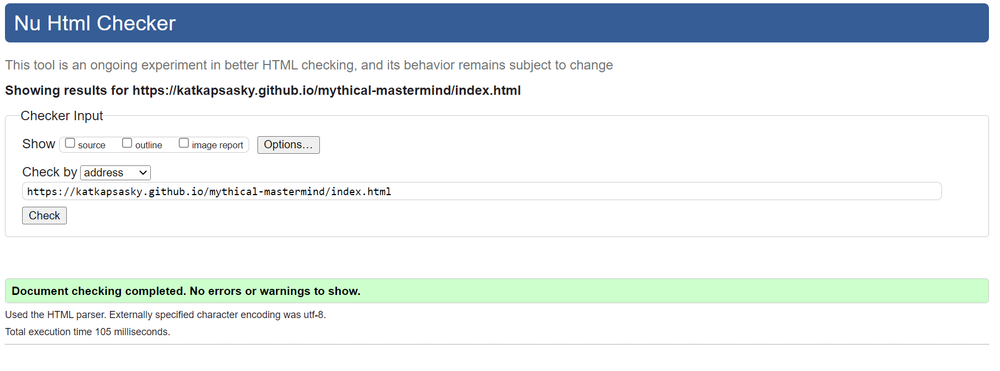
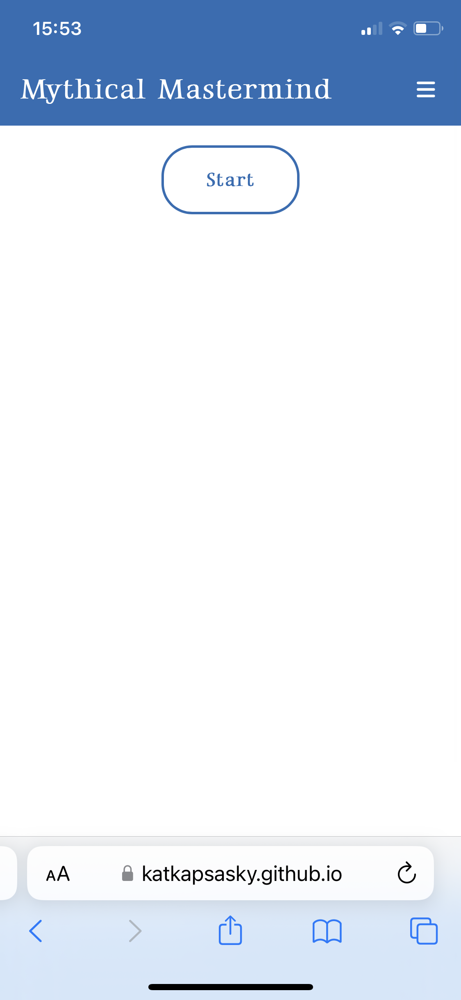
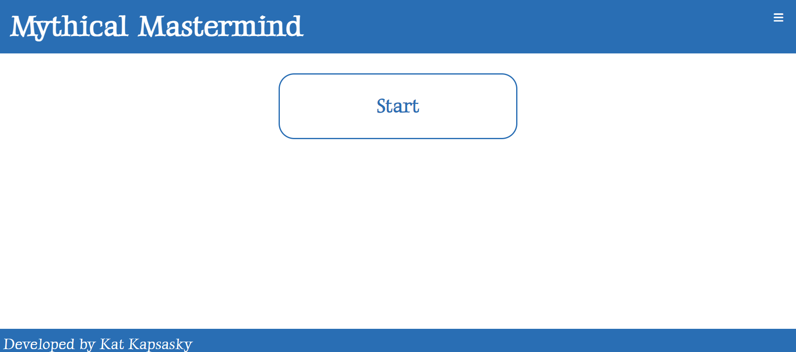
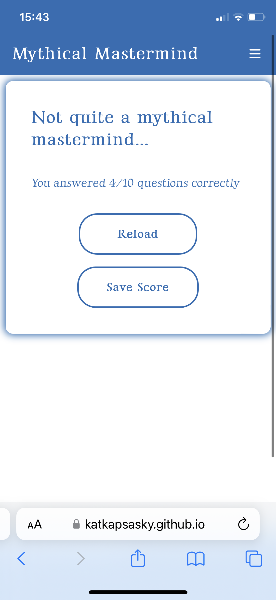
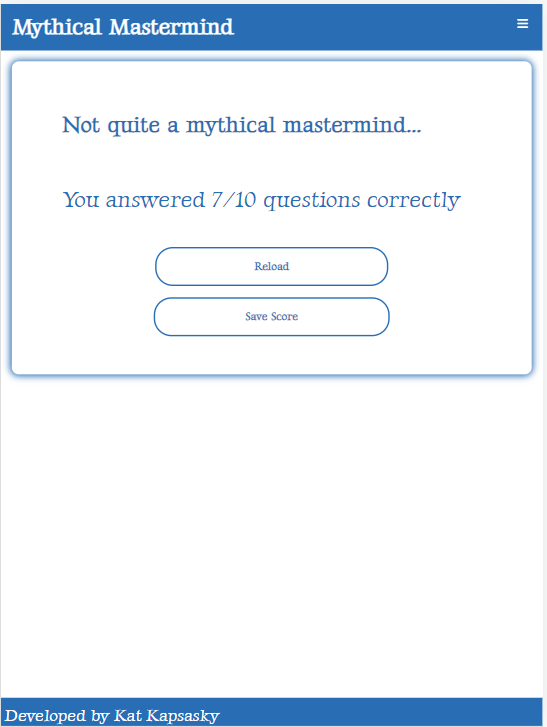

# Testing

Click to return back to the [README.md](README.md) file. 

## Manual Testing

Manual testing has been carried out which includes:
- All internal links open in the same page
- Navbar links work correctly
- Play button redirects correctly
- Quiz questions loop through correctly
- Progress counter and bar for quiz questions works correctly
- Countdown timer starts after start button is clicked and counts down correctly
- Countdown timer shows "out of time" alert after running out and gives option to restart quiz
- Score counter and result text work correctly
- Usernames and scores are correctly being saved to local storage
- High scores update correctly and show in order
- Buttons have relevant aria labels
- Image is showing correctly and alt attribute has been added
- Text and images are visible on desktop, tablet and mobile screens
- No errors in the console on any page

---

## Browser Compatibility 

The website has been tested on Google Chrome, Safari and Edge. The screenshots below show sections of the site on each browser, also with different screen sizes.

---

## Code Validation

HTML Validation:

CSS Validation:

JS Validation:

---

## Responsiveness

| Page | Screensize | Responsiveness |
| --- | --- | --- |
| Home Page | Mobile |  |
| Home Page | Tablet |  |
| Home Page | Desktop |  |
| Start | Mobile |  |
| Start | Tablet |  |
| Start | Desktop |  |
| Play Page | Mobile |  |
| Play Page | Tablet |  |
| Play Page | Desktop |  |
| Result | Mobile |  |
| Result | Tablet |  |
| Result | Desktop |  |
| Save Score | Mobile |  |
| Save Score | Tablet |  |
| Save Score | Desktop |  |
| High Scores | Mobile |  |
| High Scores | Tablet |  |
| High Scores | Desktop |  |

---

## Accessibility

The homepage, play page and high scores page have been audited with Google Lighthouse.

### Home page

### Play page

### High Scores page

---

## Bugs

### Fixed Bugs

- When I first coded the hamburger menu it wasn't showing up on the play page, I realised this was because I hadn't inserted the Font Awesome script on play.html and once I did the menu was visible across the site.

- The footer was stuck to the quiz box area on the play page. By adding a page container with a minimum height and creating a content wrap with a padding bottom for the content above the footer I was able to fix this so the footer is no longer attached to any other elements and sticks to the bottom of the page.

- When validating the code for the end.html file I also found the following errors:

I changed the empty heading to a div so that it could remain empty without causing any errors as the content for this comes from the end.js file. 

I also removed the trailing slash and located the unclosed div and closed it.

### Unfixed Bugs

There are no remaining bugs that I am aware of.

---