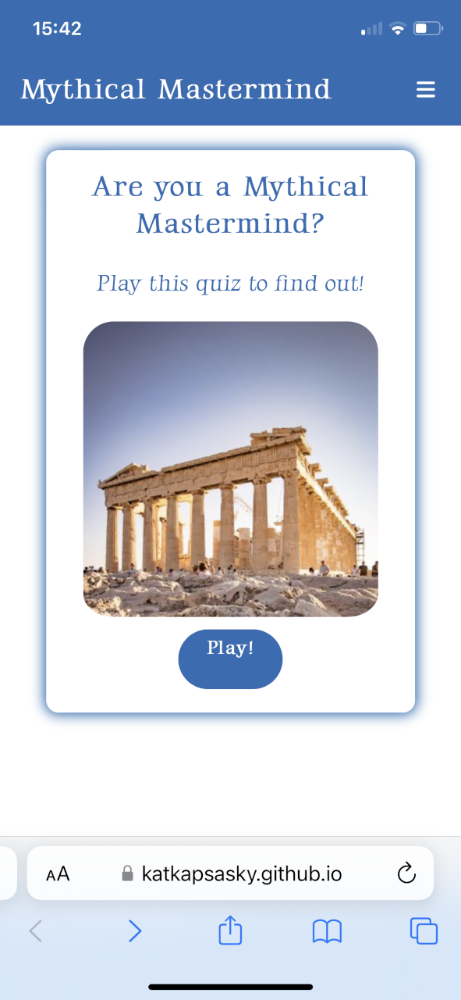
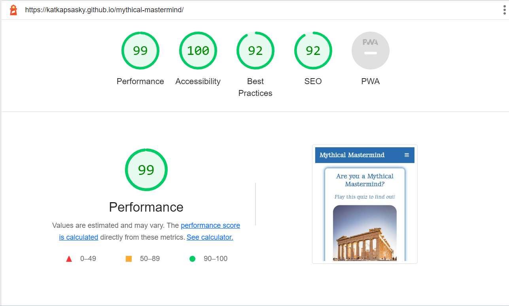

# Testing

Click to return back to the [README.md](README.md) file. 

Manual testing has been carried out which includes:
- All internal links open in the same page
- Navbar links work correctly
- Play button redirects correctly
- Quiz questions loop through correctly
- Progress counter for quiz questions works correctly
- Score counter and result text work correctly
- Buttons have relevant aria labels
- Image is showing correctly and alt attribute has been added
- Text and images are visible on desktop, tablet and mobile screens

## Browser Compatibility 

The website has been tested on Google Chrome, Safari and Edge. The screenshots below show sections of the site on each browser.

## Code Validation

HTML Validation:

CSS Validation:

JS Validation:

## Responsiveness

| Page | Screensize | Responsiveness |
| --- | --- | --- |
| Home Page | Mobile |  |
| Home Page | Tablet |  |
| Home Page | Desktop |  |
| Start | Mobile |  |
| Start | Tablet |  |
| Start | Desktop |  |
| Play Page | Mobile |  |
| Play Page | Tablet |  |
| Play Page | Desktop |  |
| Result | Mobile |  |
| Result | Tablet |  |
| Result | Desktop |  |

## Accessibility

The homepage and play page have been audited with Google Lighthouse and received a score of 100.

### Home page

### Play page

## Bugs

### Fixed Bugs

- When I first coded the hamburger menu it wasn't showing up on the play page, I realised this was because I hadn't inserted the Font Awesome script on play.html and once I did the menu was visible across the site.

- The footer was stuck to the quiz box area on the play page. By adding a page container with a minimum height and creating a content wrap with a padding bottom for the content above the footer I was able to fix this so the footer is no longer attached to any other elements and sticks to the bottom of the page.

### Unfixed Bugs

There are no remaining bugs that I am aware of.

---